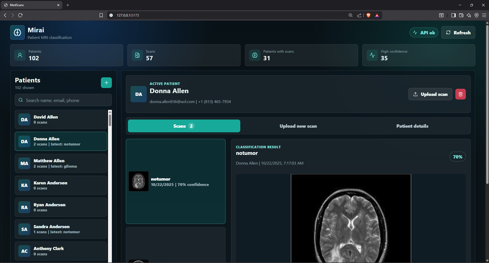
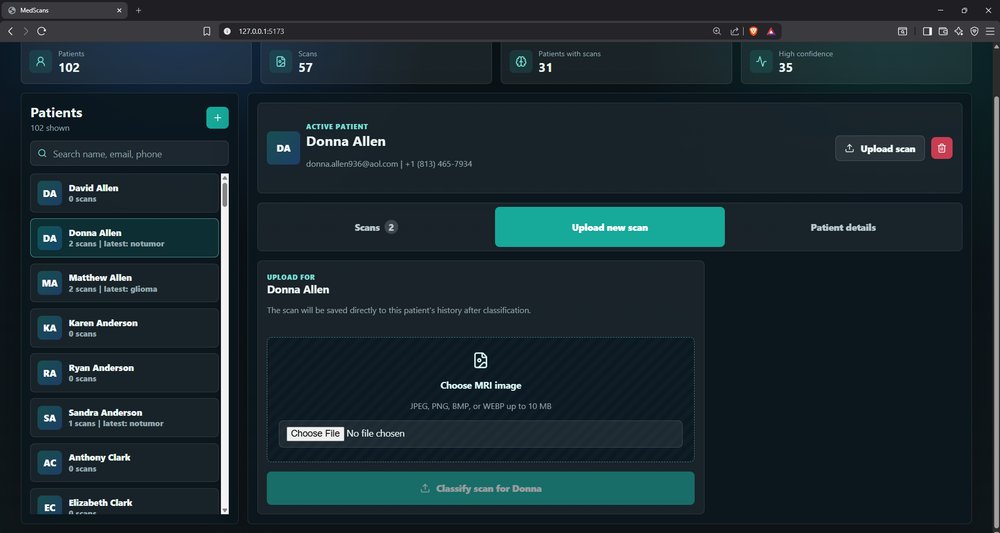
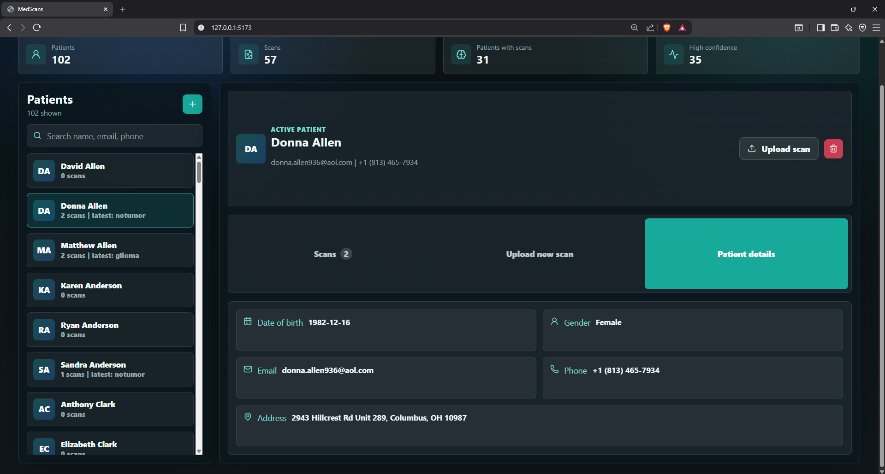

# MedScans

MedScans is a patient-centered brain MRI classification app. It combines an ASP.NET Core API, SQLite storage, an ONNX brain tumor classifier, and a React/Vite frontend.

The app lets you:

- Create and search patients.
- Open a patient workspace with details, scan history, and upload actions.
- Upload an MRI scan for the selected patient.
- Classify the scan using the local ONNX model.
- Review the predicted tumor class, confidence score, probability breakdown, and scan image.

> This project is for development and demonstration purposes. It is not a medical device and should not be used for clinical diagnosis.

## Screenshots

### Patient scan history and classification result



### Upload a new MRI scan for the selected patient



### Patient details tab



## Tech Stack

- Backend: ASP.NET Core 8
- Database: SQLite
- Machine learning inference: ONNX Runtime
- Image preprocessing: SixLabors ImageSharp
- Frontend: React 19, Vite, lucide-react
- Model: ResNet50-based brain tumor classifier exported to ONNX

## Project Structure

```text
MedScans/
  Api/                         Minimal API endpoints
  Infrastructure/              EF Core DbContext
  Patients/                    Patient entity, repository, service
  Scans/                       Scan entity, repository, service, ONNX analyzer
  Models/
    brain-tumor-resnet50.onnx  Runtime model used by the API
    brain-tumor-resnet50.pth   PyTorch checkpoint/reference model
    brain-tumor-resnet50.metadata.json
  frontend/                    React/Vite frontend
  media/                       README screenshots
  app.db                       SQLite database
  appsettings.json             API configuration
  Program.cs                   ASP.NET Core startup
  MedScans.csproj              Backend project file
```

## Prerequisites

Install these tools before running the project:

- .NET SDK 8.0 or newer
- Node.js 20 or newer
- npm, included with Node.js

Check versions:

```powershell
dotnet --version
node --version
npm --version
```

## Install Dependencies

From the project root:

```powershell
cd A:\BrainTumor\TumorDetection\MedScans
```

Restore backend dependencies:

```powershell
dotnet restore
```

Install frontend dependencies:

```powershell
cd frontend
npm install
cd ..
```

The backend uses these main NuGet packages:

- `Microsoft.EntityFrameworkCore.Sqlite`
- `Microsoft.ML.OnnxRuntime`
- `SixLabors.ImageSharp`

The frontend uses:

- `react`
- `react-dom`
- `vite`
- `@vitejs/plugin-react`
- `lucide-react`

## Model Files

The API expects the ONNX model at:

```text
Models/brain-tumor-resnet50.onnx
```

This path is configured in:

```json
"BrainTumorModel": {
  "OnnxPath": "Models/brain-tumor-resnet50.onnx"
}
```

If the ONNX file is missing, scan classification will fail. Keep the model file in `Models/` or update `appsettings.json` to point to the correct location.

## Database

The project uses SQLite:

```text
app.db
```

The connection string is configured in `appsettings.json`:

```json
"ConnectionStrings": {
  "Default": "Data Source=app.db"
}
```

The API calls `EnsureCreatedAsync()` on startup, so if `app.db` does not exist, SQLite tables are created automatically.

Main tables:

- `Patients`
- `BrainScans`

Each scan belongs to a patient through:

```text
BrainScans.PatientId -> Patients.Id
```

The UI uploads scans only inside a selected patient workspace, so new scans are linked to that patient.

## Run the Project

You need two terminals: one for the API and one for the frontend.

### Terminal 1: Start the API

From the project root:

```powershell
cd A:\BrainTumor\TumorDetection\MedScans
dotnet run --urls http://localhost:5091
```

Health check:

```text
http://localhost:5091/api/health
```

Expected response:

```json
{
  "status": "ok",
  "timestamp": "..."
}
```

### Terminal 2: Start the Frontend

```powershell
cd A:\BrainTumor\TumorDetection\MedScans\frontend
npm run dev
```

Open:

```text
http://127.0.0.1:5173
```

The Vite dev server proxies `/api` requests to:

```text
http://localhost:5091
```

This is configured in:

```text
frontend/vite.config.js
```

## Build for Production

Build the backend:

```powershell
cd A:\BrainTumor\TumorDetection\MedScans
dotnet build
```

Build the frontend:

```powershell
cd A:\BrainTumor\TumorDetection\MedScans\frontend
npm run build
```

The frontend production output is written to:

```text
frontend/dist/
```

## Run with Docker

The project includes a production Docker setup:

- `Dockerfile` builds the React frontend and publishes the ASP.NET Core API.
- The frontend `dist/` files are copied into `wwwroot`.
- ASP.NET Core serves both the API and frontend from one container.
- `docker-compose.yml` mounts the local SQLite database and model files.

Prerequisites:

- Docker Desktop

Build and run with Docker Compose:

```powershell
cd A:\BrainTumor\TumorDetection\MedScans
docker compose up --build
```

Open:

```text
http://localhost:8080
```

API health check:

```text
http://localhost:8080/api/health
```

Stop the container:

```powershell
docker compose down
```

The compose file maps:

```text
./app.db  -> /data/app.db
./Models  -> /app/Models
```

So the container uses your local SQLite database and local ONNX model.

Build only:

```powershell
docker build -t medscans .
```

Run the image manually:

```powershell
docker run --rm -p 8080:8080 `
  -e ConnectionStrings__Default="Data Source=/data/app.db" `
  -e BrainTumorModel__OnnxPath="/app/Models/brain-tumor-resnet50.onnx" `
  -v "${PWD}\app.db:/data/app.db" `
  -v "${PWD}\Models:/app/Models:ro" `
  medscans
```

## How to Use the App

1. Start the API and frontend.
2. Open `http://127.0.0.1:5173`.
3. Select a patient from the left sidebar.
4. Use the patient workspace tabs:
   - `Scans`: view that patient's scan history and classification results.
   - `Upload new scan`: upload and classify a new MRI for the selected patient.
   - `Patient details`: view demographics and contact information.
5. In the `Upload new scan` tab, choose an MRI image.
6. Click `Classify scan for <patient>`.
7. After classification, the scan appears in the selected patient's `Scans` tab.

Supported upload formats:

- JPEG
- PNG
- BMP
- WEBP

Maximum upload size:

```text
10 MB
```

## API Endpoints

Health:

```http
GET /api/health
```

Patients:

```http
GET    /api/patients
GET    /api/patients/{id}
POST   /api/patients
DELETE /api/patients/{id}
```

Scans:

```http
GET  /api/scans
GET  /api/scans/{id}
GET  /api/scans/{id}/image
POST /api/scans/analyze
```

`POST /api/scans/analyze` expects multipart form data:

```text
image     MRI image file
patientId selected patient id
```

## Common Issues

### NuGet warning NU1900

You may see:

```text
warning NU1900: Error occurred while getting package vulnerability data
```

This usually means NuGet cannot reach:

```text
https://api.nuget.org/v3/index.json
```

The build can still succeed. Check internet access, firewall, VPN, or proxy settings.

### Frontend cannot reach API

Make sure the API is running on:

```text
http://localhost:5091
```

Then restart the frontend:

```powershell
cd frontend
npm run dev
```

### Uploaded scan does not appear under a patient

New uploads should be linked automatically because the frontend sends `patientId` and the API reads it from the multipart form. If a scan does not appear:

1. Refresh the page.
2. Confirm the API is running the latest code.
3. Confirm the scan row in SQLite has a non-null `PatientId`.

### Browser layout looks different

The UI is responsive. If Chrome or Brave stacks the layout differently, check:

- Browser zoom is `100%`.
- Window width is large enough.
- DevTools or side panels are not reducing viewport width.
- Hard refresh with `Ctrl+F5`.

## Development Notes

- Backend source is in C# under `Api/`, `Patients/`, `Scans/`, and `Infrastructure/`.
- Frontend source is in `frontend/src/main.jsx` and `frontend/src/styles.css`.
- The app stores uploaded scan images as blobs in SQLite.
- The classifier result stores predicted label, confidence, class probabilities, status, analyzer version, and optional error message.

## License

Add project license information here if this repository is distributed publicly.
